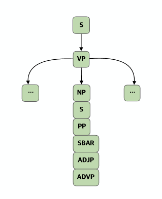
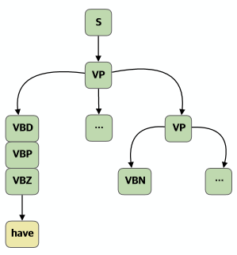

# NLP 파싱 룰 작성 가이드

## 1. 엔티티

### 1.1 Rule

    interface IRule {
        name?: string;
        match?: string; // 검색 패턴
        commands?: ICommand[],
    		relations: IRelation[] // 관계 패턴
    }

### 1.2 Command

    interface ICommand {
        cmd?: "DELETE"|"MOVE"|"SET";
        args?: string[]; // 매개변수(검색 패턴), 문장성분, "unshift"|"push"
    }

### 1.3 Relation

    interface IRelation {
        relation?: string; // ex1) nmod, ex2) nsubj|nsubjpass
        governor?: string; // 검색 패턴으로 선택
    		dependent?: string; // 검색 패턴으로 선택
    }

### 1.4 INode

    export interface INode {
        pos?: POS;
        parent?: INode;
        children?: INode[];
        word?: string;
        token?: IToken;
    		matchRules: string[];
    		// XML 변환시 사용 될 attribute
        attr?: any;
    		// XML 변환시 사용 될 엘리먼트 이름
        element?: 'sentence' | 'part' | 'cChunk' | 'sChunk' | 'word'; 
    }

## 2. 패턴 작성 규칙

- 자식관계 : ()
- 형제관계 : +
- lemma : (노드타입)=(lemma)
- 나열한 것 중 1개 : |
- 임의의 노드 0개 이상 : *
- 노드 선택 : []
- 공백 및 줄바꿈은 무시한다.

(노드 선택은 ICommand.args 에서 매개변수로 전달할 노드를 선택할 때 사용)

예시 1

    S(
        VP(
            *+NP|S|PP|SBAR|ADJP|ADVP+*
        )
    )

예시 2

예시 1에서 NP 이후의 노드들을 선택

    S(
        VP(
            *+[NP|S|PP|SBAR|ADJP|ADVP+*]
        )
    )

예시 3

    S(VP(VBD|VBP|VBZ=have+*+VP(VBN+*)))

## 3. 커맨드

### 3.1 DELETE arg1

arg1 에서 선택된 노드들을 삭제하고 arg1 의 자식들을 arg1 의 부모 노드에 연결한다.

### 3.2 MOVE arg1 arg2 arg3(default="push")

arg1 에서 선택된 노드들을 arg2 노드로 옮긴다. arg3 이 "unshift" 이면 앞에, "push" 이면 뒤로 옮긴다.

### 3.3 SET arg1 arg2 arg3

arg1 에서 선택된 노드의 atrribute 의 키 arg2 를 arg3 으로 설정

### 3.4 CREATE arg1 arg2 arg3(default="push")

arg2 노드를 새로 생성해서 arg1 target의 뒤(push) 혹은 앞(unshift) 에 붙인다.

### 3.5 REPLACE arg1 arg2

arg1 노드의 pos 를 arg2 로 바꾼다.

### 3.6 ELEMENT arg1 arg2

arg1 노드의 element 를 arg2 로 설정한다.

## 4. 룰 에디터

관리자페이지 ([https://admin.lango.co.kr](https://admin.lango.co.kr)) - CMS - NLP

새로운 룰 작성, 편집, 순서 변경 등의 기능을 제공한다.